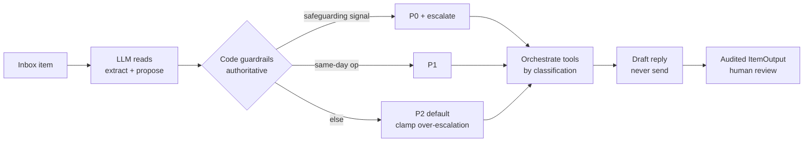

# Cedar Kids Therapy — Referral Inbox Triage Agent

`TypeScript` · `Node LTS` · `npm` · runs **with or without** an LLM key · `npm run validate` ✓ · `npm run eval` ✓

An AI agent prototype that turns a messy Monday-morning shared inbox (pediatrician fax
referrals, parent voicemails, portal messages, emails) into a sorted, **human-reviewable**
action plan. It produces one structured, audited output item per inbox item — and it never
acts on its own: it drafts, surfaces, and escalates, but never sends a message or books an
appointment.



> **The one idea:** the LLM *reads*, deterministic code *decides*. Safety lives in code, so a
> model misread can never bypass a P0 escalation — and "URGENT!!!" wording never over-escalates.

---

## How to run

```bash
npm install

# defaults shown
npm run triage   -- --input data/inbox.json --output output.json --trace .trace/tool-calls.jsonl
npm run validate -- --input data/inbox.json --output output.json --trace .trace/tool-calls.jsonl
```

Both commands also work with **no flags** and default to the paths above.

To enable the runtime LLM (recommended), set the key in your environment first:

```bash
export ANTHROPIC_API_KEY=sk-...        # synthetic data 
npm run triage
```

**The agent runs with or without a key.** Without `ANTHROPIC_API_KEY` it falls back to a
deterministic classifier and still produces valid output that passes `npm run validate`
(safety guardrails, including the P0 safeguarding catch, are pure code and work in both modes).

Other checks:

```bash
npm run typecheck   # strict TypeScript, no emit
npm run eval        # safety-critical assertions over the real inbox + adversarial variants
```

`npm run eval` is a committed, runnable version of the stress-testing I did while building. It
asserts the judgments that matter — safeguarding is caught (P0 + escalate), a same-day reschedule
stays P1, and a fake-"URGENT" trivial ask is **not** over-escalated — and it passes with **or
without** the API key, because those guardrails are code, not prompt. Runtime is a few seconds.

---

## Stack and runtime

- **Language / runtime:** TypeScript on Node LTS, run via `tsx`. npm.
- **LLM (optional, recommended):** Anthropic `@anthropic-ai/sdk`, model `claude-haiku-4-5`
  (overridable via `TRIAGE_MODEL`). Haiku is fast and cheap and the task is per-item
  classification/extraction, not long-form generation. **Model choice is not load-bearing** —
  the safety logic lives in code, so a different model (or none) still produces safe output.
- **Provided tooling (unmodified):** `src/tools.ts` (8 tools + audit trace), `src/index.ts`
  (CLI + `buildBatchOutput`), `src/validate.ts`, `schema/output.schema.json`.
- **What I wrote:** `src/agent.ts` (orchestration + guardrails) and `src/llm.ts` (LLM extraction).

---

## Architecture

**Hybrid: the LLM reads, deterministic code decides.** For each item (processed sequentially
so the audit trace is clean and attributable):

```
withItemContext(item.id):
  1. READ      llmTriage()        LLM extracts intake + PROPOSES classification/urgency/signals
  2. GUARDRAIL applyGuardrails()  CODE is authoritative — enforces safety & calibration
  3. ORCHESTRATE                  CODE picks the right tools for the classification
  4. DRAFT                        empathetic reply (Spanish when requested), or null if no contact
  5. ASSEMBLE                     tools_called = getToolCallsForItem(id), passed through unchanged
                                  + reconcileEscalation() invariant
  (whole item wrapped in try/catch → safe P2 manual-review fallback; one bad item never breaks the batch)
```

**Why guardrails live in code, not the prompt.** Safety must not be something a model can be
talked out of. So these are deterministic:

- **Safeguarding → P0.** If the LLM flags a harm/abuse/unsafe-caregiving signal **or** a
  keyword check fires, the item is forced to `safeguarding` / `P0` and escalated, regardless of
  what service was requested. (Catches item_2's "dad started getting rough with him".)
- **Anti-over-escalation clamp.** Urgency `P0`/`P1` is only allowed when backed by a real safety
  or same-day-operational reason; otherwise it is clamped to `P2`. "URGENT!!!" wording alone
  never inflates urgency. (Keeps item_8's reschedule at P1, not P0; keeps a reworded "EMERGENCY"
  parking question at P2/P3.)
- **Escalation/urgency invariant.** `reconcileEscalation()` guarantees an escalation exists iff
  urgency is `P0`/`P1` and its severity equals the urgency — so a handler default can never
  contradict a clamped urgency.
- **No-send / no-schedule, structurally.** We only ever call `draft_message` (never send) and
  `find_slots` (never `hold_slot`/book).

**Tool orchestration by classification** (7 of 8 tools used, each as part of a real decision):

| Classification | Tools used | Decision logic |
|---|---|---|
| new_referral | search_patient, verify_insurance, find_slots / lookup_policy, create_task, draft_message | In-network → surface slots for staff. Out-of-network/expired → lookup insurance policy + billing task, **no slot**. search_patient surfaces possible existing-patient/identity matches. |
| safeguarding | lookup_policy(safeguarding), escalate(P0), create_task(clinical_lead), draft_message | Neutral acknowledgement only (no investigative content); same-hour clinical review. |
| clinical_question | lookup_policy(clinical_advice), create_task(intake), draft_message | Route to screening/eval; **never give clinical advice by message**. |
| scheduling | search_patient, find_slots, create_task(front_desk), draft_message | Same-day reschedule = P1; offer makeup slot for review, don't auto-book. |
| missing_paperwork | create_task(intake) | Chase the referring office for missing fields; no parent draft when no contact exists. |

**Audit discipline:** every tool call goes through the provided tools inside
`withItemContext`, and `tools_called[]` is exactly `getToolCallsForItem(item.id)` — call IDs,
args, and result summaries are passed through verbatim so they match the validator's trace check.
We only call a tool when we will surface it (no orphaned trace entries, no performative calls).

---

## Worked examples (the two calibration traps)

The brief warns that **over-escalation is itself a failure**. The visible inbox plants one item
that *looks* routine but is a safety event, and one that *looks* urgent but is routine. The agent
must get both right — `npm run eval` asserts exactly these.

**item_2 — a "speech eval" voicemail that hides a safeguarding disclosure → forced to P0:**

```json
{
  "item_id": "item_2",
  "classification": "safeguarding",
  "urgency": "P0",
  "tools_called": ["lookup_policy(safeguarding)", "escalate(P0)", "create_task(clinical_lead)", "draft_message"],
  "escalation": { "severity": "P0", "reason": "Possible child-safety disclosure; immediate clinical escalation." },
  "draft_reply": "Thank you for reaching out about your child. A member of our clinical team will follow up with you directly...",
  "decision_rationale": "Safeguarding signal detected ('dad started getting rough with him'). Forced to P0 regardless of the requested service. Draft is a neutral acknowledgement only — no investigative content, per policy."
}
```

**item_8 — an ALL-CAPS "URGENT!!!" email that is only a same-day reschedule → P1, not P0:**

```json
{
  "item_id": "item_8",
  "classification": "scheduling",
  "urgency": "P1",
  "escalation": { "severity": "P1", "reason": "Same-day reschedule requires prompt front-desk action today." },
  "decision_rationale": "Same-day reschedule is a P1 operational issue. The 'URGENT' wording reflects parent stress, not a safety event, so it is not escalated to P0."
}
```

*(Trimmed for readability — see `output.json` for the full audited records with real call IDs.)*

---

## Failure modes and production eval

**Failure modes I'm aware of:**

- **LLM misclassification / hallucinated intake.** Mitigated by code guardrails (safety can't be
  bypassed) and by strict output coercion (enum validation, `[blank]`/`null` handling). Residual
  risk: a *false-negative* safeguarding miss is the worst case — see below.
- **Safeguarding false negatives.** The keyword backstop is deliberately conservative but
  finite; novel phrasing could slip past the keyword layer and rely solely on the LLM. In
  production this needs a tuned classifier + human-in-the-loop on anything near the boundary.
- **Identity/duplicate ambiguity.** item_4 surfaces an existing record with a *different
  guardian name* — the agent flags it for human confirmation rather than guessing. Auto-merging
  patients would be a serious production error.
- **Insurance source-of-truth conflicts.** Policy says the billing system supersedes the
  referral document; the agent verifies and surfaces the discrepancy rather than trusting the fax.
- **LLM/API outage or missing key.** Falls back to a deterministic classifier; the batch still
  completes and validates. Per-item try/catch isolates failures so one bad item can't crash the run.

**How I'd evaluate this in production:**

- **Golden set + regression suite:** labeled inbox items with expected urgency/classification/
  escalation; run on every change. A seed of this ships as `npm run eval` (real inbox +
  adversarial variants with safety assertions). (The variant set during development —
  reworded abuse, fake-urgent, spam, billing-in-Spanish, near-empty fax — caught a real
  escalation/urgency coherence bug.)
- **Safety-weighted metrics, not just accuracy:** track **safeguarding recall** (false negatives
  are unacceptable) and **over-escalation rate** (P0/P1 that a human downgrades) as a named KPI,
  since over-escalation is itself a failure.
- **Human-review feedback loop:** capture reviewer overrides on urgency/classification/draft as
  labeled training/eval data.
- **Draft-safety linting:** automated checks that drafts contain no clinical advice and never
  imply a message was sent.

---

## What I chose not to build, and why

- **`hold_slot` (8th tool).** Deliberately unused. Holding a slot edges toward scheduling, which
  the brief prohibits; `find_slots` + a human-review task is the safer, more honest posture.
- **Attachment/PDF parsing.** Referral PDFs are referenced but not parsed; intake is extracted
  from the message body. Real intake needs OCR/document parsing.
- **Per-call retries / structured tool-use loop.** A single structured LLM call per item is
  enough here and keeps runtime and cost low; I noted this rather than over-engineering under the
  time box.
- **Rich Spanish/i18n.** I detect Spanish, route to Spanish-capable providers, and draft in
  Spanish, but didn't build a full localization layer.
- **Provider/slot ranking.** Slots are surfaced for staff to choose; the agent doesn't rank or
  auto-select beyond discipline/language filtering.

---

## What I would do with another 4 hours

1. **Harden safeguarding recall** — a dedicated safety classifier with a tuned threshold and an
   eval set focused on false negatives across paraphrases and languages.
2. **Real golden-set eval harness** — formalize the variant testing into `npm run eval` with
   labeled expectations and safety-weighted metrics (safeguarding recall, over-escalation rate).
3. **Confidence + abstention** — when the model is unsure, lower urgency confidence should widen
   `missing_info` and push more firmly to human review rather than guessing.
4. **Attachment parsing** for fax PDFs to complete intake (and reconcile against the message body).
5. **Draft-safety linter** in CI to enforce "no clinical advice / no implied send" automatically.
6. **Idempotency / dedup** across the batch (e.g. two channels referencing the same child).
```
